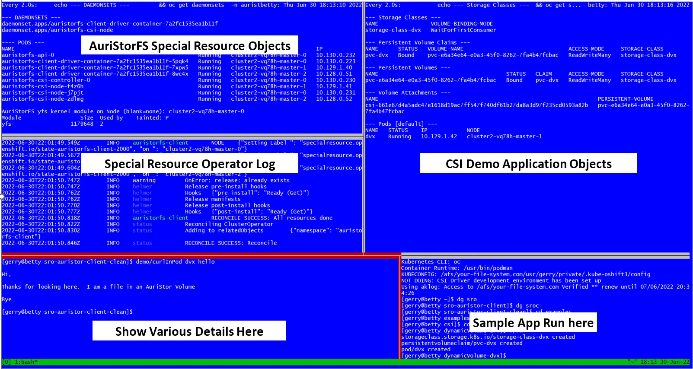

# AuriStorFS SRO Demo

## Demo Description

Scripts are provided to show various aspects of 

* The Special Resource Operator
* The AuriStorFS Special Resource
* An [example application](../csi/dynamicVolume-dv) using the AuriStorFS CSI Driver 

The Below Screenshot shows the terminal setup used for this demo

## Demo Scripts
| Script | Description |		
|---|---|		
|	appWatch	|	Watch the example application object creation (Pod, PVC, PV, SC, VolumeAttachment)
|	curlInPod	|	Curl in the nginx example Pod to show AFS Volume serving data
|	daemonSetNodeSelectors	|	Show that the SRO created Daemonsets have the appropriate Node Selector for the NFD provided labels
|	kmodReport	|	Display if/that the yfs Kernel Module has been loaded on the OpenShift Node
|	lsroWatch	|	Watch the Special Resource Operator Log
|	nodeLabels	|	Display the NFD provided lables on the node
|	sroWatch	|	Watch the AuriStorFS Special Resource created objects
